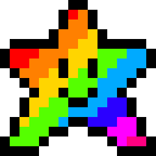
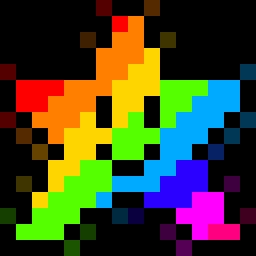
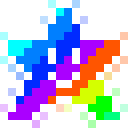
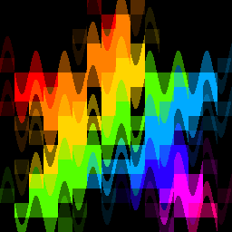

# glitchd

Lightweight CLI tool to transform a static image into a glitched GIF.

[](LICENSE)

## Requirements

- Python 3.10+
- Pillow >=10.0.0
- numpy >=1.24.0

## Installation

```
git clone https://github.com/randomscript7/glitchd
cd glitchd
pip install -r requirements.txt
```

## Usage

```
python -m glitchmaker config.json # Compile GIF from config settings
python -m glitchmaker config.json --fps 15 --seed 123 --overlap average # ... same, but overriding some config settings
```

### glitchmaker Flags

| Flag | Description |
|------|-------------|
| `--fps N`<br>`--seed N`<br>`--overlap {stack/average}`<br>`--output-dir DIR`<br>`--gif-length SEC`<br>`--input FILE`<br>`--effects JSON` | Override config settings (`--effects` expects a JSON array string) |
| `--no-gif` | Render frames, skip GIF compilation |
| `--discard-frames` | Compile GIF, delete generated frames |
| `--benchmark` | Render with timing summary, then delete all output |

### showcase.py flags

showcase.py generates the demo GIFs in this README.

| Flag | Description |
|------|-------------|
| `--filter TERM [TERM ...]` | Only generate demos matching TERM category (color, data, distortion, noise, rgb)|
| `--dry` | Print configs and commands without rendering |
| `--benchmark` | Print per-entry render timing table |

## Writing a config file

```
{
  "input": "rainbow-star.png", # Path to input image
  "output_dir": "output", # Where to output frames + GIF
  "fps": 15, # GIF fps
  "gif_length": 5.0, # GIF length in seconds
  "seed": 1337, # Seed for reproducibility
  "overlap": "average", # for multi-effect configs `stack` (sequential) or
                        `average` (parallel + pixel mean)
  "effects": [
      {
          "effect": "chromaticAberration", # Name of the effect
          "params": { "amount": 50 }, # Effect strength, generally 0–100
           "start": 1.0, # Time the effect starts during the GIF
           "end": 5.0, # Time the effect ends during the GIF
           "ramp": "ascend" # Amplitude over time (ascend, descend, peak, constant)
      }
      # ... Add more here
  ]
}
```

### Overlap Modes & Ramp

More on this in [the Overlap section](#overlay-mode-stack-vs-average). There are two overlap modes:

- **stack**: Effects applied sequentially — output of one feeds into the next
- **average**: Each effect applied independently to original, pixels averaged (includes original in average)

The `ramp` field controls how amplitude changes over the effect's duration. More on this in [the Ramp section](#ramp-modifiers). 

## Generating Showcase GIFs

```bash
python showcase.py                       # Generate all 30 showcase GIFs (24 single-effect + 2 overlay + 4 ramp)
python showcase.py --filter noise        # Only entries matching "noise"
python showcase.py --dry                 # Print configs/commands without rendering
```

---

## Effect Showcase

Visual reference for every core effect in glitchmaker. Each GIF is a 1.5-second animation at 12fps using `overlap: average`, `ramp: "ascend"`, and `seed: 42`. The following is the base image used in all configs:



### RGB Effects

RGB channel offsets as percentages of image dimensions.

| Effect | Preview | Params | Description |
|---|---|---|---|
| `rgbShift` |  | `rgbRedX:10, rgbRedY:5, rgbGreenX:-10, rgbGreenY:-5, rgbBlueX:5, rgbBlueY:0` | Independent R/G/B offsets — classic fringing. |
| `chromaticAberration` |  | `amount:30` | Red/blue split from centre — lens fringing. |
| `channelShift` |  | `amount:40` | Radial pincushion separation. |

### Noise Effects

| Effect | Preview | Params | Description |
|---|---|---|---|
| `noise` |  | `amount:70, scale:5` | Per-pixel noise modulated by sine/cosine pattern. `scale` controls frequency. |
| `interference` |  | `amount:90, color:#ff00ff` | Random coloured horizontal bars (`color: #ff00ff`). |
| `scanLines` |  | `lines:50, opacity:80` | Alternating darkened lines — CRT simulation. |

### Distortion Effects

| Effect | Preview | Params | Description |
|---|---|---|---|
| `hShake` |  | `amount:40` | Random horizontal offset per frame. |
| `vShake` |  | `amount:35` | Random vertical offset per frame. |
| `blockDistort` |  | `amount:60, blockSize:12` | Random block offsets. |
| `waveDistort` |  | `amount:50, waveFreq:20` | Sinusoidal vertical warp. |
| `edgeCorruption` |  | `amount:60` | Random coloured pixels on border (20px). |

### Colour Effects

| Effect | Preview | Params | Description |
|---|---|---|---|
| `colorShift` |  | `amount:120` | Hue rotation in degrees. |
| `saturation` |  | `amount:80` | Boost/attenuate intensity. |
| `brightness` |  | `amount:-30` | Uniform value shift (clamped 0-255). |
| `contrast` |  | `amount:50` | Light/dark difference. |
| `grayscale` |  | `amount:90` | Blend toward luminance. |
| `sepia` |  | `amount:80` | Sepia matrix blend. |
| `vintage` |  | `amount:70` | Warm wash — aged film. |
| `invert` |  | `invert:true` | Binary 255 − value. Ramp has no visible effect. |

### Data Effects

| Effect | Preview | Params | Description |
|---|---|---|---|
| `pixelSort` |  | `amount:85` | Sort adjacent pixels by brightness — melting streaks. |
| `dataMosaic` |  | `amount:70` | Block-average mosaic. |
| `digitalRain` |  | `amount:70` | Green 10px vertical streaks — Matrix rain. |
| `compressionArtifacts` |  | `amount:85` | 8×8 block toward centre colour — JPEG artefacts. |
| `bufferOverflow` |  | `amount:55` | Random line copy with colour jitter — frame-buffer corruption. |

> **Example config (applies to any row above):**
> ```json
> {"effect": "noise", "params": {"amount": 70, "scale": 5}, "start": 0.0, "end": 1.5, "ramp": "ascend"}
> ```

---

### Overlay Mode: Stack vs Average

Two effects (scanLines + noise) applied with different overlap modes. **Stack** applies effects sequentially — each effect's output feeds the next. **Average** applies each effect independently to the original image, then averages all pixel values together.

| Mode | Behaviour |
|------|----------|
| `stack` | Sequential: effect A output → input for effect B |
| `average` | Parallel: each effect operates on the original, results are averaged (includes original in average) |


*Stack mode — effects compound*


*Average mode — effects blend with original*

```json
{
  "effects": [
    { "effect": "scanLines", "params": { "lines": 50, "opacity": 80 },
      "start": 0.0, "end": 1.5, "ramp": "ascend" },
    { "effect": "noise", "params": { "amount": 50, "scale": 5 },
      "start": 0.0, "end": 1.5, "ramp": "ascend" }
  ]
}
```

---

### Ramp Modifiers

A single effect (`waveDistort`) shown with four ramp settings. **Constant** applies full amplitude for the entire duration. **Ascend** linearly increases amplitude from 0% to 100%. **Descend** decreases from 100% to 0%. **Peak** creates a symmetric triangle — 0% → 100% → 0%.

| Ramp | Behaviour |
|------|----------|
| `"constant"` | Amplitude stays constant at the specified value |
| `"ascend"` | Amplitude ramps linearly from 0 → full |
| `"descend"` | Amplitude ramps linearly from full → 0 |
| `"peak"` | Amplitude ramps 0 → full → 0 |


*Constant — effect at full strength immediately for full time*


*Ascend — effect builds up over time*


*Descend — effect fades out over time*


*Peak — effect builds up then fades out, climaxing in the middle*

Effect config used:

```json
{
  "effect": "waveDistort",
  "params": { "amount": 50, "waveFreq": 20 },
  "start": 0.0, "end": 1.5, "ramp": "constant"
}
```

---

## Acknowledgements

- This project was inspired by [Notnoob14's glitch-effect-maker](https://websim.com/@Notnoob14/glitch-effect-maker) project on websim.
- The demo image `rainbow-star.png` came from [here on OpenGameArt](https://opengameart.org/sites/default/files/Magical%20rainbow%20star.png).